# AI 作文批改系统

<p align="center">
  <strong>🎓 面向 K-12 教育场景的 AI 作文智能批改平台</strong>
</p>

<p align="center">
  
  
  
  
  
  
</p>

## 📖 项目简介

学生在线编辑或拍照上传手写作文，系统通过阿里云百炼 AI 进行**多维度智能批改**（内容、结构、语言、书写），教师可审核 AI 批改结果并进行二次修改。同时提供学情数据可视化、AI 对话辅导和智能错题本功能。

**核心价值：** 让学生获得即时、专业、多维度的作文反馈——减轻教师批改负担的同时，为每个学生提供个性化的写作指导。

## ✨ 功能特性

| 功能模块 | 描述 |
|---------|------|
| 📝 作文提交 | 在线富文本编辑 + 拍照上传手写作文（OCR 识别） |
| 🤖 AI 智能批改 | 四维度评分（内容35分 + 结构25分 + 语言25分 + 书写15分） |
| 👩‍🏫 教师审核 | 教师可审核、修改 AI 批改结果并发布 |
| 📊 学情分析 | 成绩趋势、雷达图、班级排名等数据可视化 |
| 💬 AI 对话辅导 | 基于作文内容的个性化 AI 写作辅导 |
| 📚 智能错题本 | 自动归类错误类型，支持标记掌握状态 |
| 🏫 班级管理 | 教师创建班级、布置作业、管理学生 |

---

## 🖼️ 系统截图

### 首页 & 认证

<p align="center">
  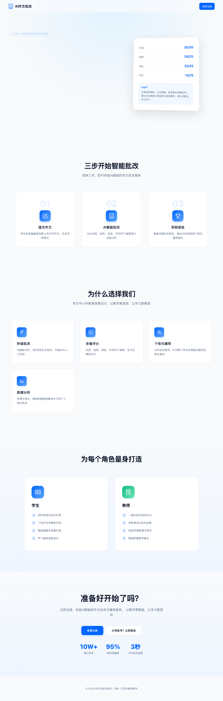
</p>
<p align="center"><em>系统首页 - 产品介绍与功能展示</em></p>

<p align="center">
  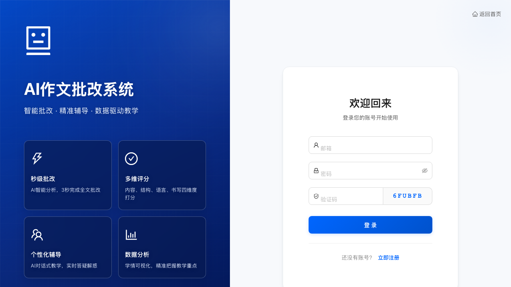
  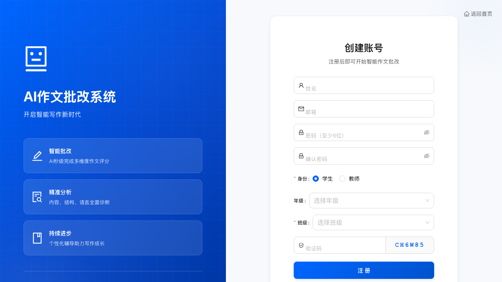
</p>
<p align="center"><em>登录页 & 注册页 - 支持学生/教师角色选择</em></p>

### 教师端

<p align="center">
  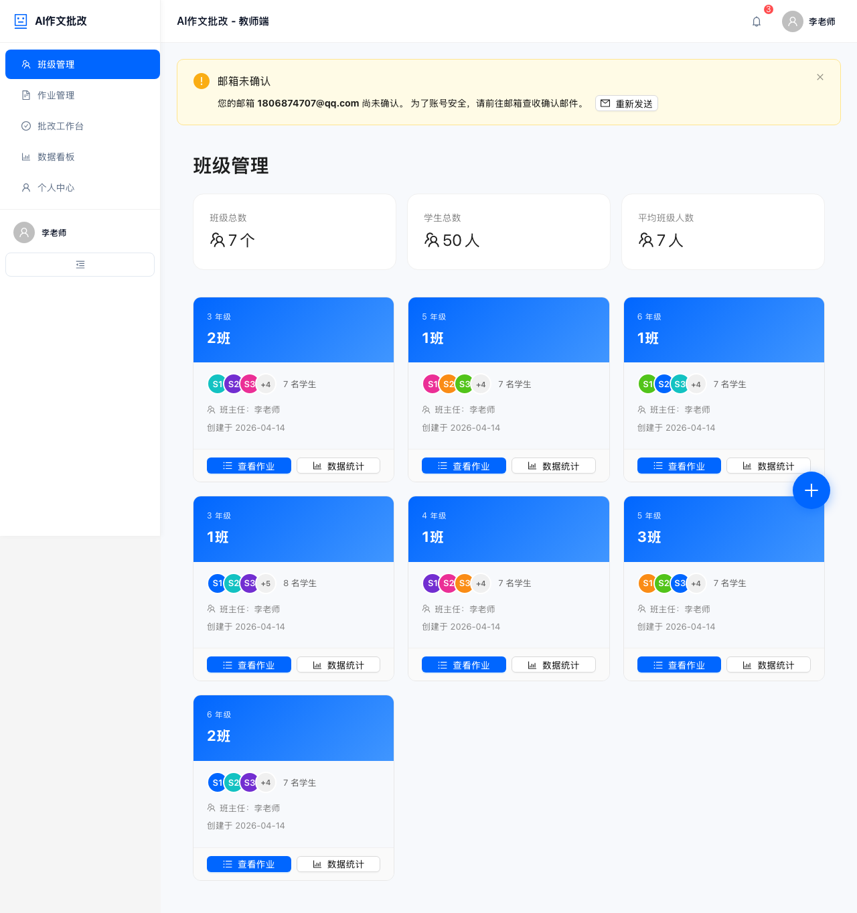
</p>
<p align="center"><em>班级管理 - 创建和管理教学班级</em></p>

<!-- PLACEHOLDER_TEACHER_SECTION -->

<p align="center">
  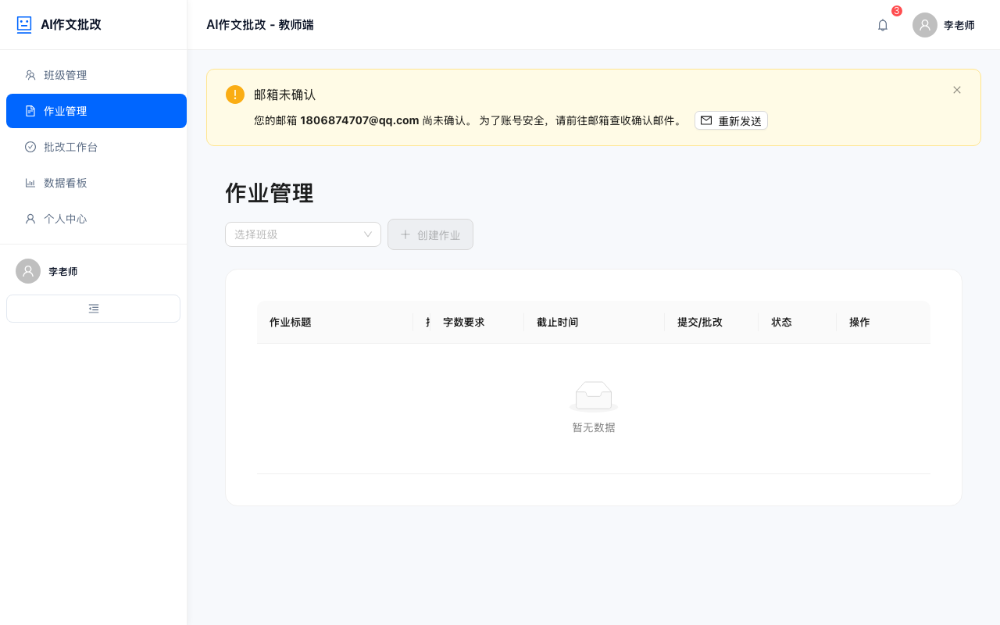
</p>
<p align="center"><em>作业管理 - 布置写作任务、设置截止时间</em></p>

<p align="center">
  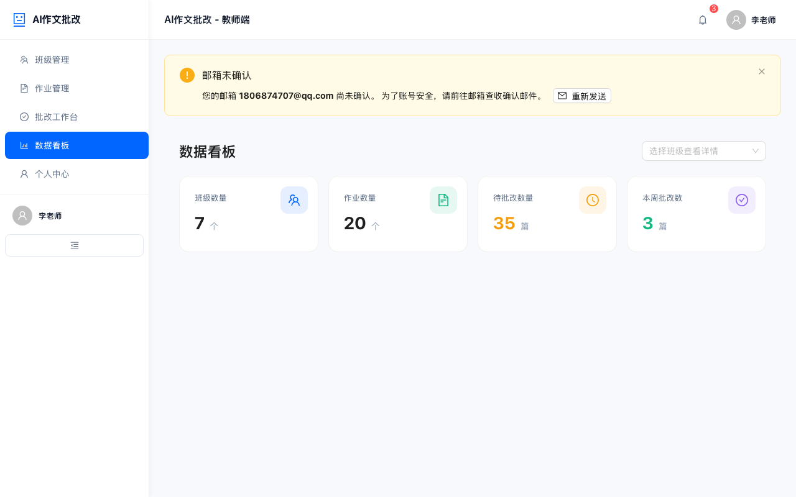
</p>
<p align="center"><em>数据看板 - 班级学情分析与统计</em></p>

### 学生端

<p align="center">
  
</p>
<p align="center"><em>作业列表 - 查看待完成的写作任务</em></p>

<p align="center">
  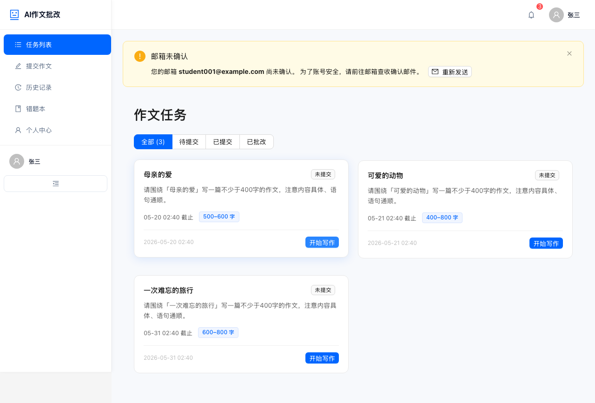
</p>
<p align="center"><em>作文提交 - 富文本编辑器 + 图片上传 OCR</em></p>

<p align="center">
  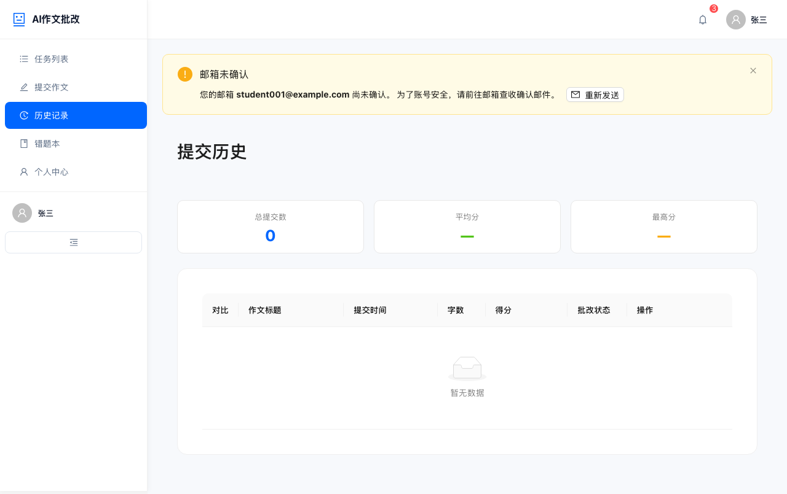
</p>
<p align="center"><em>提交历史 - 查看所有作文的批改状态</em></p>

<p align="center">
  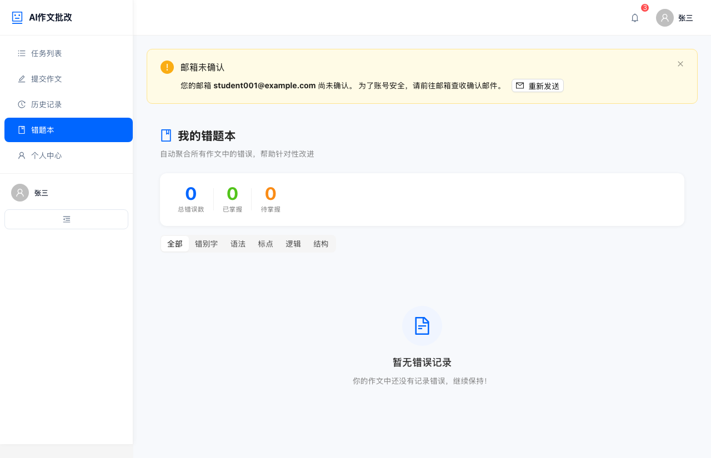
</p>
<p align="center"><em>智能错题本 - 自动归类错误，支持标记掌握</em></p>

<p align="center">
  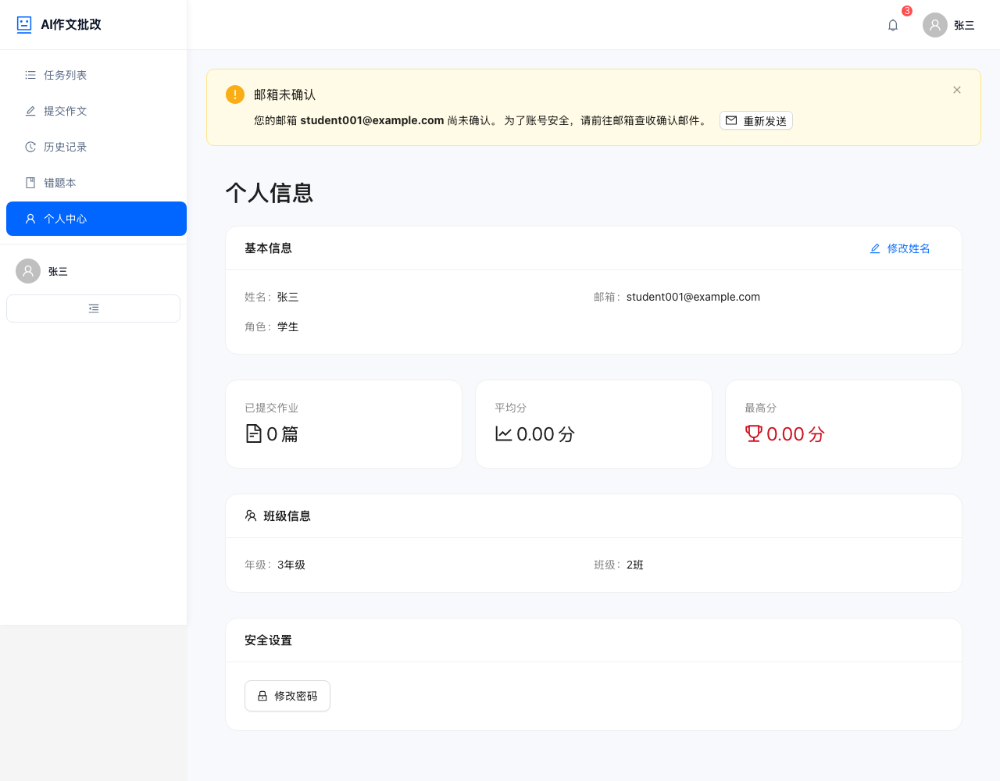
</p>
<p align="center"><em>个人中心 - 学习数据统计与成长曲线</em></p>

---

## 🏗️ 系统架构

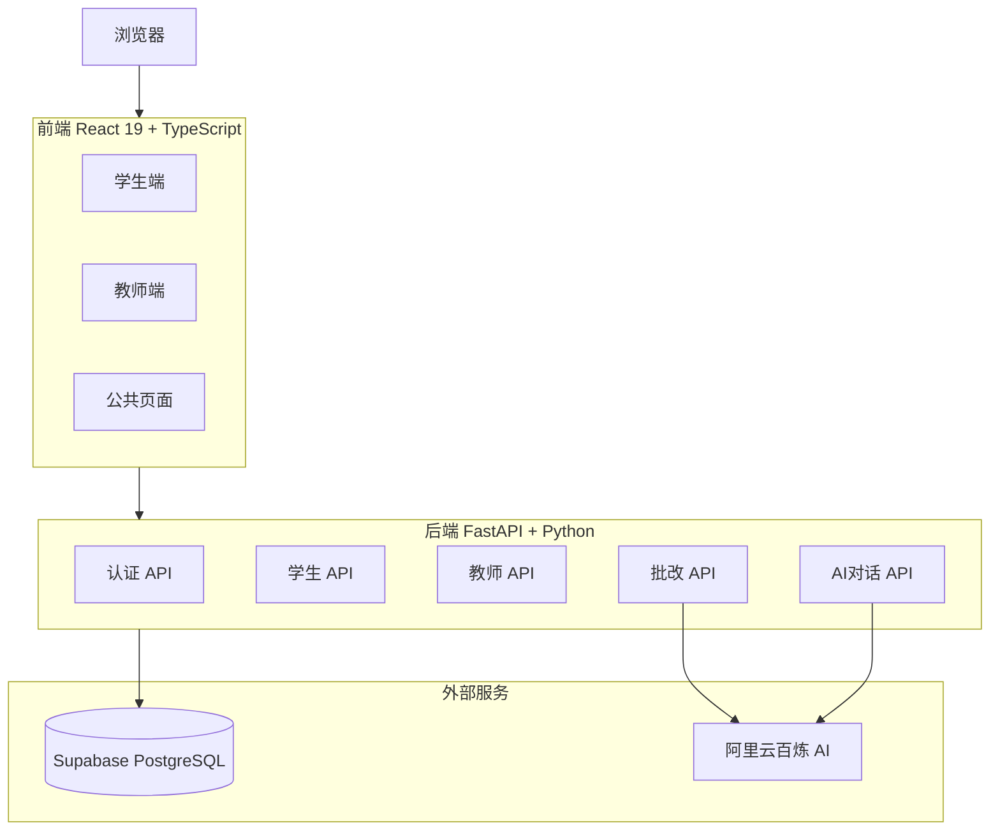

---

## 📋 业务流程

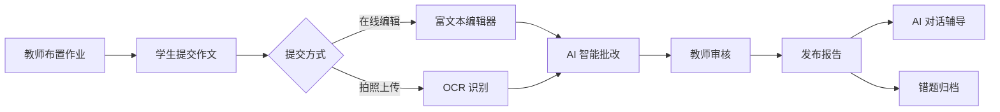

### AI 批改评分维度

| 维度 | 分值 | 评估内容 |
|------|------|---------|
| 思想内容 | 35分 | 主题明确、内容充实、思想健康 |
| 结构安排 | 25分 | 层次清晰、段落合理、首尾呼应 |
| 语言表达 | 25分 | 用词准确、句式多样、修辞恰当 |
| 文字书写 | 15分 | 字迹工整、标点正确、格式规范 |

---

## 🛠️ 技术栈

### 前端
- **框架**: React 19 + TypeScript 5.9
- **UI 库**: Ant Design 5
- **状态管理**: Zustand 5 (with persist)
- **构建工具**: Vite 7
- **图表**: ECharts 5
- **富文本**: TipTap (ProseMirror)
- **测试**: Playwright (E2E)

### 后端
- **框架**: Python 3.10+ / FastAPI
- **数据库**: Supabase (PostgreSQL)
- **认证**: Supabase Auth + JWT
- **AI**: 阿里云百炼 DashScope (OpenAI SDK 兼容模式)
- **OCR**: qwen-vl-plus 多模态模型

---

## 🚀 快速开始

### 环境要求

- Node.js >= 18
- Python >= 3.10
- Supabase 项目（免费版即可）
- 阿里云百炼 API Key

### 1. 克隆项目

```bash
git clone git@github.com:adongwanai/ai-essay-grading.git
cd ai-essay-grading
```

### 2. 配置环境变量

```bash
# 后端
cp backend/.env.example backend/.env
# 编辑 backend/.env 填入 Supabase 和 DashScope 配置

# 前端
cp frontend/.env.example frontend/.env
# 编辑 frontend/.env 填入 Supabase 公钥配置
```

### 3. 启动后端

```bash
cd backend
pip install -r requirements.txt
python main.py
# 服务运行在 http://localhost:8000
# API 文档: http://localhost:8000/docs
```

### 4. 启动前端

```bash
cd frontend
npm install
npm run dev
# 服务运行在 http://localhost:5173
```

### 5. 配置检查

```bash
./check-config.sh  # 验证环境变量配置
```

> 详细配置说明请参考 [快速配置指南](QUICK_START.md) 和 [详细配置文档](CONFIG_GUIDE.md)

---

## 📁 项目结构

```
ai-essay-grading/
├── frontend/                # React 前端
│   ├── src/
│   │   ├── components/      # 公共组件
│   │   ├── pages/
│   │   │   ├── student/     # 学生端页面
│   │   │   └── teacher/     # 教师端页面
│   │   ├── services/        # API 调用层
│   │   └── store/           # Zustand 状态管理
│   ├── e2e/                 # Playwright E2E 测试
│   └── package.json
│
├── backend/                 # FastAPI 后端
│   ├── api/                 # 路由层 (auth, student, teacher, grading, ai-chat, mistakes)
│   ├── core/                # 配置 (pydantic-settings)
│   ├── external/            # 外部服务封装 (Supabase, DashScope)
│   ├── schemas/             # Pydantic 数据模型
│   └── main.py              # 应用入口
│
├── docs/                    # 文档 & 截图
├── scripts/                 # 工具脚本
└── start.sh                 # 启动引导脚本
```

---

## 🎯 开发方法论

本项目基于 **Vibe Coding** 方法论开发：

- **胶水编程**: 90% 使用成熟开源库，核心业务代码 < 4000 行
- **能抄不写**: 直接使用 Ant Design 组件、Supabase Auth、OpenAI SDK
- **分层清晰**: API 层 → Service 层 → 外部服务层

---

## 📦 部署

### 前端 (Vercel)

```bash
cd frontend && npm run build
# 部署到 Vercel，配置环境变量
```

### 后端 (Railway / 任意 VPS)

```bash
cd backend
# 配置环境变量后部署
uvicorn main:app --host 0.0.0.0 --port 8000
```

---

## 📄 开源协议

MIT License

---

## 👤 作者

**阿东** - 大模型算法工程师，OPC创业者

基于 Vibe Coding CN 方法论构建
